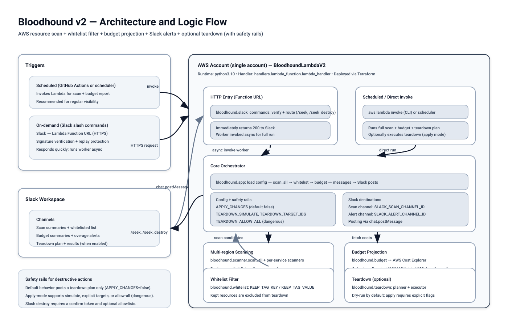

# Bloodhound v2 (AWS resource scanner + Slack alerts + optional teardown)

Bloodhound v2 scans selected AWS regions for common cost-leak resources, posts results to Slack, and can optionally delete resources that are **not** whitelisted.

- Clone this repo
- Configure `.env` for local testing
- Rebuild the deployment zip locally (the `.build/` dir is not committed)
- Configure Lambda env vars to match your `.env`

If you need to create a Slack bot from scratch, see `docs/SLACK_SETUP.md`.

Project docs:

- v2 plan: `docs/V2_PLAN.md`



---

## Requirements

- Python 3.10+ for local dev (or match your Lambda runtime)
- AWS CLI configured (use `AWS_PROFILE=...` as needed). To set it up the first time: `aws configure --profile <name>` (or `aws configure` for the default profile). To see what profiles you have: `aws configure list-profiles`; your local config/creds live in `~/.aws/config` and `~/.aws/credentials` (view with `cat ~/.aws/config` and `cat ~/.aws/credentials`).
- Slack bot token and channel IDs

---

## Local setup + testing

### Create a venv and install dependencies

From this directory:

```bash
python3 -m venv .venv
.venv/bin/python -m pip install --upgrade pip
.venv/bin/python -m pip install -r requirements.txt
```

### Configure `.env`

Create `.env` from `env.example` and fill it in:

```bash
cp env.example .env
```

Bloodhound v2 automatically loads `.env` for local runs.

### Run locally

```bash
# Choose the AWS profile you want to test with:
AWS_PROFILE=geekstar .venv/bin/python tools/run_local.py
```

---

## Whitelisting

Resources tagged with:

- key: `bloodhound:keep`
- value: `true`

are treated as **kept (whitelisted)** and are excluded from teardown.

---

## Teardown controls (important)

By default, Bloodhound posts a teardown plan only:

- `APPLY_CHANGES=false`

To delete/terminate non-whitelisted resources:

- `APPLY_CHANGES=true`

Safety rails:

- **simulate (no deletes)**: `TEARDOWN_SIMULATE=true`
- **only delete explicit IDs/ARNs**: set `TEARDOWN_TARGET_IDS=...`
- **delete everything not whitelisted**: `TEARDOWN_ALLOW_ALL=true`

---

## Build the Lambda deployment zip (v2)

The `.build/` directory is intentionally not committed. Terraform will build the zip automatically (see `infra/README.md`).

---

## Deploy to AWS Lambda (v2)

Deploy to a new function name so you do not touch your existing v1 Lambda:

- Function name: `BloodhoundLambdaV2`
- Handler: `handlers.lambda_function.lambda_handler`

### Configure Lambda environment variables

In Lambda Console → **Configuration → Environment variables**, copy the values from your local `.env`.

At minimum:

- Slack: `SLACK_BOT_TOKEN`, `SLACK_SCAN_CHANNEL_ID`, `SLACK_ALERT_CHANNEL_ID`
- Regions: `REGION_MODE`, `REGIONS`
- Budget: `COHORT_START_YYYY_MM`, `COHORT_TOTAL_BUDGET_USD`, `COHORT_LENGTH_MONTHS`, `BUDGET_OVER_DAYS`
- Teardown: `APPLY_CHANGES`, `TEARDOWN_SIMULATE`, `TEARDOWN_ALLOW_ALL`, `TEARDOWN_TARGET_IDS`

### Test the Lambda via AWS CLI

```bash
aws lambda invoke \
  --function-name BloodhoundLambdaV2 \
  --payload file://tools/test_event.json \
  output.txt \
  --region us-west-2

cat output.txt
```

---

## GitHub Actions (invoke v2)

This repo includes a separate workflow for v2:

- `.github/workflows/invoke_lambda_v2.yml`

It invokes:

- `BloodhoundLambdaV2`

---

## Slack slash commands (v2)

Slash commands require a publicly reachable HTTPS endpoint. For v2 we recommend a **Lambda Function URL** (one endpoint) and route based on the Slack `command` field.

- `/seek` runs scan + reports (non-destructive)
- `/seek_destroy CONFIRM` runs destructive mode (deletes all non-whitelisted candidates we scan for)

To enable slash commands you must set these env vars in Lambda:

- `SLACK_SIGNING_SECRET`
- `SLACK_ALLOWED_USER_IDS` (optional)
- `SLACK_ALLOWED_CHANNEL_IDS` (optional)
- `SLACK_DESTROY_CONFIRM_TOKEN` (default `CONFIRM`)
