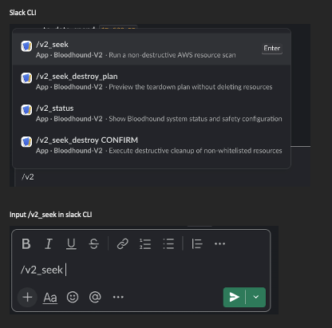
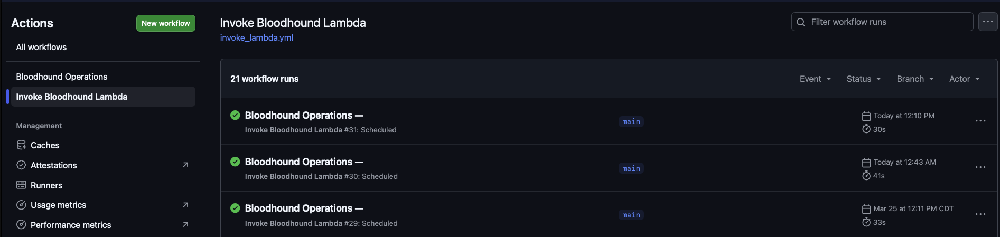
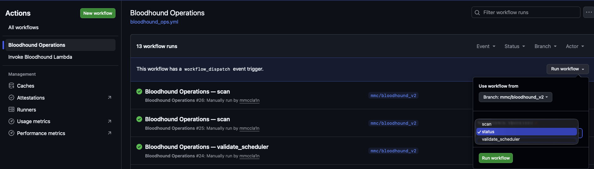
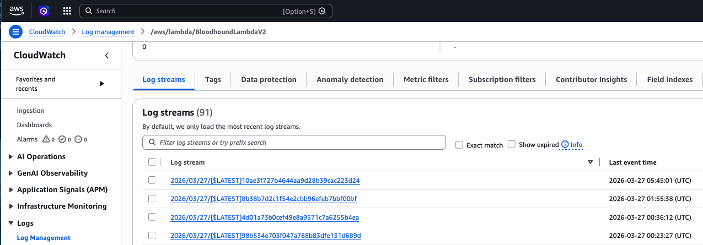

# Bloodhound Quick Demo Guide

This guide demonstrates the primary capabilities of Bloodhound.

## Operational Scenarios

This guide walks through the following operational scenarios:

1. [Run Bloodhound Locally](#scenario-1--run-bloodhound-locally)
2. [Slack Scan Command](#scenario-2--slack-scan-command)
3. [Generate a Teardown Plan](#scenario-3--generate-a-teardown-plan)
4. [Controlled Teardown Execution](#scenario-4--controlled-teardown-execution)
5. [Automated Scheduled Scans (GitHub Actions)](#scenario-5--automated-scheduled-scans-github-actions)
6. [Manual Operations (GitHub Actions)](#scenario-6--manual-operations-github-actions)
7. [CloudWatch Log Inspection](#scenario-7--cloudwatch-log-inspection)
8. [Automated Teardown Validation Workflow](#scenario-8--automated-teardown-validation-workflow)

---

### Bloodhound can be operated in four ways:

- Local CLI execution
- Slack commands
- Automated GitHub Actions scans
- Manual GitHub Actions operations

# Local Configuration

Before running Bloodhound locally, you must configure the environment variables used by the system.

Bloodhound loads configuration from a `.env` file during local execution.

## Step 1 — Create the `.env` File

.env is only used for local development.

In production, these values are configured in:
AWS Lambda → Environment Variables.

Copy the example configuration:

```bash
cp env.example .env
```

## Step 2 — Update Required Values

Open .env and set the required values for your environment.

At minimum you must configure:

EXPECTED_AWS_ACCOUNT_ID=<your_aws_account_id>

SLACK_BOT_TOKEN=<your_slack_bot_token>
SLACK_SIGNING_SECRET=<your_slack_signing_secret>

SLACK_SCAN_CHANNEL_ID=<your_channel_id>
SLACK_ALERT_CHANNEL_ID=<your_channel_id>

## Step 3 — Confirm AWS Profile

Verify which AWS profiles are available:

```bash
aws configure list-profiles
```

Example output:

```bash
default
```

## Step 4 — Verify AWS Identity

Confirm your credentials point to the correct AWS account:
```bash
aws sts get-caller-identity
```
Example output:

```json
{
  "Account": "388691194728"
}
```

This account ID must match the value set in:
`EXPECTED_AWS_ACCOUNT_ID`

Safety Defaults

The default .env configuration runs Bloodhound in safe mode:

APPLY_CHANGES=false
TEARDOWN_SIMULATE=true

This means:

infrastructure will not be deleted
Bloodhound will only scan and generate a teardown plan

---

# Scenario 1 — Run Bloodhound Locally

Bloodhound can be executed locally using the built-in runner.

### Verify AWS Profile

From the repository root, confirm which AWS profiles are available:

```bash
aws configure list-profiles
```

Example output:
`default`

Command

Run Bloodhound locally using a valid AWS profile:

Syntax Usage:
```bash
AWS_PROFILE=<your_profile> python -m tools.run_local
```

This command is useful for:

debugging scans locally
validating AWS credentials
testing pipeline behavior before deploying changes
What Happens

The runner:

loads .env
authenticates with AWS using the specified profile
invokes the Bloodhound pipeline

Pipeline stages:

```
scan_resources()      # scans AWS resources (EC2, ELBv2, RDS)
compute_budget()      # calculates potential cost savings
plan_teardown()       # builds a teardown plan (no deletion)
```

### Important

Local execution runs in safe mode by default.

This command will:

scan AWS resources
identify unused infrastructure
estimate potential cost savings
generate a teardown plan

It will NOT delete resources unless destructive mode is explicitly enabled.

Equivalent Slack Command

Running this locally performs the same scan as the Slack command:

/v2_seek

### Example Output

Example terminal output:

```bash
aws configure list-profiles
default

AWS_PROFILE=default python -m tools.run_local
```
```json
Bloodhound pipeline started
Event: {}
Bloodhound pipeline completed
Scan summary:
{
  "candidates_total": 61,
  "kept_total": 1
}
Budget summary:
{
  "projected_month_end_spend_usd": 3645.4766142570115,
  "dynamic_monthly_allowance_usd": 0.0,
  "over_budget_threshold_met": true
}
Teardown summary:
{
  "apply_changes": false,
  "simulate": true,
  "planned_actions": 61
}
{
  "budget": {
    "dynamic_monthly_allowance_usd": 0.0,
    "over_budget_threshold_met": true,
    "projected_month_end_spend_usd": 3645.4766142570115
  },
  "ok": true,
  "regions": [
    "us-east-1",
    "us-east-2",
    "us-west-1",
    "us-west-2"
  ],
  "scan": {
    "candidates_total": 61,
    "kept_total": 1
  },
  "teardown": {
    "apply_changes": false,
    "execution": null,
    "planned_actions": 61,
    "simulate": true,
    "targets_filter": null
  }
}
```

---

# Scenario 2 — Slack Scan Command

Bloodhound can be triggered interactively using Slack slash commands.

### Slack Command

```
/v2_seek
```

### Command Preview in Slack



### What Happens

1. Slack sends an HTTPS request to the Lambda Function URL
2. Lambda routes the request to the Slack handler
3. Bloodhound executes the scan pipeline

Execution path:

```
Slack
 ↓
Lambda Function URL
 ↓
slack_handler
 ↓
execute_pipeline()
```

Slack returns multiple messages summarizing:

- scan results
- whitelisted resources
- budget analysis
- teardown plan (dry run)

---

## Scan Summary

```md
Bloodhound v2 — Scan Summary
time_et: 8:23 PM ET

Region: us-east-1
Counts: candidates 32 | kept 0
- Candidates: ec2.instance=15, rds.db_instance=1, ec2.elastic_ip=4, ec2.nat_gateway=0, ec2.ebs_volume=0, elbv2.load_balancer=12
- Kept: ec2.instance=0, rds.db_instance=0, ec2.elastic_ip=0, ec2.nat_gateway=0, ec2.ebs_volume=0, elbv2.load_balancer=0

Region: us-east-2
Counts: candidates 7 | kept 1
- Candidates: ec2.instance=1, rds.db_instance=0, ec2.elastic_ip=3, ec2.nat_gateway=1, ec2.ebs_volume=0, elbv2.load_balancer=2
- Kept: ec2.instance=1, rds.db_instance=0, ec2.elastic_ip=0, ec2.nat_gateway=0, ec2.ebs_volume=0, elbv2.load_balancer=0

Region: us-west-1
Counts: candidates 0 | kept 0

Region: us-west-2
Counts: candidates 22 | kept 0

Totals
Counts: candidates 61 | kept 1
```

---

## Whitelisted Resources

```md
Bloodhound v2 — Whitelisted Resources (Kept)

kept_total: 1

Region: us-east-2
- us-east-2 ec2.instance i-00339b9b5023ec69e (Name=cp-fs-curriculum)
```

---

## Budget Summary

```md
Bloodhound v2 — Budget Summary

Cohort
- start: 2025-12
- total_budget: $3,000.00 over 7 months
- to_date_spend: $6,261.11
- remaining_budget: $0.00
- remaining_months: 4
- monthly_allowance: $0.00

This month
- month_to_date: $3,057.50
- projected_month_end: $3,510.46
- over_budget_days_required: 2
- over_budget_threshold_met: true
```

---

## Teardown Plan (Dry Run)

```md
Bloodhound v2 — Teardown Plan (DRY RUN)

mode: DRY RUN — No AWS resources will be deleted

planned_actions: 61

Top Regions Affected
- us-east-1: 32
- us-west-2: 22
- us-east-2: 7

Services affected
- ec2: 46
- elbv2: 14
- rds: 1
```

Bloodhound operates in **dry-run mode by default**, ensuring no AWS resources are deleted unless destructive mode is explicitly enabled.

---

# Scenario 3 — Generate a Teardown Plan

This command previews which AWS resources **could be removed** without deleting anything.

### Slack Command

`/v2_seek_destroy_plan`

### What Happens

Bloodhound executes the full analysis pipeline:

```md
scan_resources()
compute_budget()
plan_teardown()
```

The teardown stage generates a **deletion plan**, but no resources are deleted.

Bloodhound always runs in **dry-run mode** unless destructive mode is explicitly enabled.

---

### Example Slack Output

When `/v2_seek_destroy_plan` is executed, Bloodhound posts multiple analysis messages.

---

## Scan Summary

```md
Bloodhound v2 — Scan Summary
time_et: 8:36 PM ET

Region: us-east-1
Counts: candidates 32 | kept 0
- Candidates: ec2.instance=15, rds.db_instance=1, ec2.elastic_ip=4, ec2.nat_gateway=0, ec2.ebs_volume=0, elbv2.load_balancer=12
- Kept: ec2.instance=0, rds.db_instance=0, ec2.elastic_ip=0, ec2.nat_gateway=0, ec2.ebs_volume=0, elbv2.load_balancer=0

Region: us-east-2
Counts: candidates 7 | kept 1
- Candidates: ec2.instance=1, rds.db_instance=0, ec2.elastic_ip=3, ec2.nat_gateway=1, ec2.ebs_volume=0, elbv2.load_balancer=2
- Kept: ec2.instance=1, rds.db_instance=0, ec2.elastic_ip=0, ec2.nat_gateway=0, ec2.ebs_volume=0, elbv2.load_balancer=0

Totals
Counts: candidates 61 | kept 1
```

---

## Budget Summary

```md
Bloodhound v2 — Budget Summary

Cohort
- start: 2025-12
- total_budget: $3,000.00 over 7 months
- to_date_spend: $6,261.11
- remaining_budget: $0.00
- remaining_months: 4
- monthly_allowance: $0.00

This month
- month_to_date: $3,057.50
- projected_month_end: $3,510.46
- over_budget_threshold_met: true
```

---

## Teardown Plan (Dry Run)

```md
Bloodhound v2 — Teardown Plan (DRY RUN)

mode: DRY RUN — No AWS resources will be deleted

planned_actions: 61

Top Regions Affected
- us-east-1: 32
- us-west-2: 22
- us-east-2: 7

Services affected
- ec2: 46
- elbv2: 14
- rds: 1
```

Sample actions generated by the teardown planner:

```md
delete_db_instance
delete_load_balancer
delete_nat_gateway
delete_volume
release_address
terminate_instances
```

This preview allows engineers to safely review what infrastructure **would be removed** before enabling destructive mode.

---

# Scenario 4 — Controlled Teardown Execution

Bloodhound can perform automated infrastructure cleanup, but destructive actions
require multiple explicit confirmations.

### Slack Command

`/v2_seek_destroy CONFIRM`

This command executes the teardown plan generated by Bloodhound.

However, deletion only occurs if **all safety controls allow it**.

---

### Safety Controls

Infrastructure deletion only occurs when the following environment configuration is enabled:

```md
APPLY_CHANGES=true
TEARDOWN_SIMULATE=false
```

Additional safeguards are built into the system:

```md
TEARDOWN_MAX_DELETE_COUNT
whitelisting tags
Terraform deployment guard
Slack confirmation token
```

These protections ensure that accidental deletions cannot occur.

---

### Why This Demo Does Not Execute Destructive Mode

This documentation intentionally **does not run the destructive command**.

In normal operation engineers should:

1. run `/v2_seek` to scan resources
2. run `/v2_seek_destroy_plan` to preview cleanup actions
3. review the teardown plan
4. enable destructive mode only after validation

This ensures infrastructure cleanup remains **safe, auditable, and intentional**.

---

### Safe Example Output

When destructive mode is **not enabled**, Bloodhound reports that the system
remains in dry-run mode:


Bloodhound v2 — Teardown Plan (DRY RUN)

mode: DRY RUN — No AWS resources will be deleted
simulate: true

planned_actions: 61


To execute the plan, engineers must explicitly enable destructive mode
through configuration and deployment controls.

---

# Scenario 5 — Automated Scheduled Scans (GitHub Actions)

Bloodhound can run automatically using GitHub Actions.



This repository includes a scheduled workflow that invokes the Bloodhound
Lambda function on a fixed schedule.

Workflow file:

`.github/workflows/invoke_lambda.yml`

### Scheduled Execution

The workflow runs twice per day:

```md
16:00 UTC  → 11:00 AM EST
04:00 UTC  → 11:00 PM EST
```

GitHub cron jobs only run from the repository **default branch**.

---

### Example Workflow Invocation

The workflow builds a deterministic Lambda event payload:

```json
{
  "source": "scheduled"
}
```

Lambda is then invoked using the AWS CLI:

```bash
aws lambda invoke \
  --function-name BloodhoundLambdaV2 \
  --payload file://event.json \
  output.json
```

---

### What Happens

```md
GitHub Actions (scheduler)
 ↓
OIDC authentication
 ↓
Assume BloodhoundGitHubInvokeRole
 ↓
Invoke Bloodhound Lambda
 ↓
Execute scheduled scan pipeline
 ↓
Log results to GitHub Actions + CloudWatch
```

The Lambda pipeline performs:

scan_resources()
compute_budget()
plan_teardown()

---

### Example GitHub Actions Output

Lambda invocation completed successfully
```json
Scan summary:

{
  "candidates_total": 61,
  "kept_total": 1
}


Budget summary:
{
  "projected_month_end_spend_usd": 3645.47,
  "dynamic_monthly_allowance_usd": 0.0,
  "over_budget_threshold_met": true
}

Teardown summary:
{
  "apply_changes": false,
  "simulate": true,
  "planned_actions": 61
}
```

The workflow also retrieves recent Lambda logs from CloudWatch to improve
observability during CI runs.

---

# Scenario 6 — Manual Operations (GitHub Actions)

Bloodhound operators can manually trigger infrastructure operations
directly from the GitHub Actions interface.



Workflow file:

`.github/workflows/bloodhound_ops.yml`

This workflow allows engineers to run operational commands
without waiting for the scheduled automation.

---

### Available Operations

When launching the workflow, the operator can choose a mode:

```md
scan                → run infrastructure scan immediately
status              → display Bloodhound system status
validate_scheduler  → simulate scheduled EventBridge execution
```

These options are selected from the **GitHub Actions UI** when clicking
"Run workflow".

---

### Execution Path

```md
GitHub Actions UI
 ↓
workflow_dispatch
 ↓
OIDC authentication
 ↓
Assume BloodhoundGitHubInvokeRole
 ↓
Invoke Bloodhound Lambda
 ↓
Execute selected operation
```

---

### Example Lambda Payload

Example payload generated for a scan operation:

```json
{
  "source": "scan"
}
```

Example payload for a status check:

```json
{
  "source": "status"
}
```

---

### Example GitHub Actions Output

Bloodhound Operation: scan

Invoking Bloodhound Lambda

```json
Scan summary:
{
  "candidates_total": 61,
  "kept_total": 1
}

Budget summary:
{
  "projected_month_end_spend_usd": 3645.47,
  "dynamic_monthly_allowance_usd": 0.0,
  "over_budget_threshold_met": true
}

Teardown summary:
{
  "apply_changes": false,
  "simulate": true,
  "planned_actions": 61
}
```
---

### Example Execution — Scheduler Validation

The `validate_scheduler` mode simulates the automated EventBridge
trigger used by scheduled infrastructure scans.

Example payload generated by the workflow:

```json
{"source":"scheduled"}
```

Example GitHub Actions output:

```md
========================================
Bloodhound Operation: validate_scheduler
========================================

===== VALIDATING SCHEDULER PATH =====
Simulating EventBridge scheduled event
{"source":"scheduled"}

Invoking Bloodhound Lambda
```

Example Lambda response:

```json
{
  "status": "scheduled_scan_executed",
  "result": {
    "ok": true,
    "regions": [
      "us-east-1",
      "us-east-2",
      "us-west-1",
      "us-west-2"
    ],
    "scan": {
      "candidates_total": 58,
      "kept_total": 1
    },
    "budget": {
      "projected_month_end_spend_usd": 3138.03,
      "dynamic_monthly_allowance_usd": 0.0,
      "over_budget_threshold_met": true
    },
    "teardown": {
      "apply_changes": false,
      "simulate": true,
      "planned_actions": 58
    }
  }
}
```

### Example Execution — Status Operation

The `status` mode checks the operational health of the Bloodhound
Lambda service without running a full infrastructure scan.

Example payload generated by the workflow:

```json
{
  "source": "status"
}
```

Example GitHub Actions output:

```md
========================================
Bloodhound Operation: status
========================================

Invoking Bloodhound Lambda

Bloodhound status check completed
Lambda invocation completed successfully
```

The workflow confirms:

- Lambda is reachable
- IAM role assumption is functioning
- invocation permissions are correct
- the Bloodhound runtime is operational

Example Lambda logs (excerpt):

```md
[BLOODHOUND][SCHEDULED]

Event received: {'source': 'scheduled'}

Scheduled Bloodhound scan triggered
Bloodhound pipeline started
Bloodhound pipeline completed
```

### CloudWatch Logs

During execution, the GitHub Actions workflow also retrieves recent
logs from the Lambda CloudWatch log group:

`/aws/lambda/BloodhoundLambdaV2`

This provides deeper visibility into:

- Lambda execution traces
- pipeline stage logging
- AWS API activity
- runtime performance metrics

Operators can view the full logs directly in the AWS Console:

`CloudWatch → Log Groups → /aws/lambda/BloodhoundLambdaV2`

---

# Scenario 7 — CloudWatch Log Inspection

All Bloodhound executions emit structured logs to CloudWatch.

Log format:

`[BLOODHOUND][EVENT_TYPE][request_id=...]`


These logs provide visibility into pipeline execution,
including scans, budget analysis, and teardown planning.

---

### Example CloudWatch Logs

```text
[BLOODHOUND][SCHEDULED][request_id=17774179-8cfc-49ee-a503-c2e9d091a1ee]

Event received: {'source': 'scheduled'}

Scheduled Bloodhound scan triggered
Bloodhound pipeline started
Event: {"source": "scheduled"}
Bloodhound pipeline completed
```

```json
Scan summary:
{
  "candidates_total": 58,
  "kept_total": 1
}

Budget summary:
{
  "projected_month_end_spend_usd": 3138.03,
  "dynamic_monthly_allowance_usd": 0.0,
  "over_budget_threshold_met": true
}

Teardown summary:
{
  "apply_changes": false,
  "simulate": true,
  "planned_actions": 58
}
```
---

### Viewing Logs (AWS CLI)

Operators can stream logs directly from CloudWatch:

```bash
aws logs tail /aws/lambda/BloodhoundLambdaV2 \
  --region us-west-2 \
  --follow
```

This command continuously streams new Bloodhound
Lambda logs as they are generated.

---

### Viewing Logs (AWS Console)

Bloodhound Lambda logs can also be inspected directly
from the AWS Console.

Steps:

1. Open the AWS Console
2. Select the correct region
`United States (Oregon) — us-west-2`

3. Navigate to CloudWatch
CloudWatch → Logs → Log Management

4. Locate the Bloodhound Lambda log group

Search for:
`BloodhoundLambdaV2`

5. Select a log stream

Each Lambda invocation creates a log stream containing:

- request IDs
- pipeline execution stages
- scan summaries
- budget calculations
- teardown planning results

### Console Walkthrough

A visual walkthrough of the CloudWatch navigation process
is provided below.

📄 View guide:

[CloudWatch Log Navigation](docs/demo/cloudwatch_log_navigation.pdf)

The guide includes screenshots showing:

- selecting the correct AWS region
- opening CloudWatch
- locating the Bloodhound log group
- selecting a log stream
- inspecting Lambda execution logs
---



---

# Scenario 8 — Automated Teardown Validation Workflow

Bloodhound includes an automated validation workflow that verifies the entire destructive pipeline in a controlled environment.

This workflow confirms that Bloodhound can:

detect infrastructure resources
generate a teardown plan
execute deletion
verify that the resource was removed

The workflow creates a temporary disposable EC2 instance and verifies that Bloodhound successfully deletes it.

Validation Script

The validation workflow is executed using the orchestration script:
`tools/run_validation_workflow.sh`

This script coordinates the full validation process and logs results.

Run the Validation Workflow

From the repository root:
```bash
./tools/run_validation_workflow.sh
```

What Happens

The validation workflow executes the following sequence:

```text
Lambda smoke test
 ↓
Terraform creates disposable EC2 instance
 ↓
Validation event sent to Bloodhound Lambda
 ↓
Bloodhound teardown pipeline executes
 ↓
Instance deletion verified
 ↓
Validation workflow completes
```

This confirms that the actual destructive execution path works safely.

Example Validation Output

Example terminal output from the validation workflow:

`./tools/run_validation_workflow.sh`

```md
================================================
Bloodhound Validation Workflow
================================================
```

Step 1: Running Lambda smoke test...

✓ Lambda function exists
✓ Environment variables validated
✓ CloudWatch log group exists
✓ Lambda Function URL configured

Smoke test passed.

Step 2: Starting controlled teardown validation...

Validation Run ID: 20260326_205446

Creating disposable EC2 instance...

Instance created:
i-01fee506f85a03005

Triggering Bloodhound validation teardown...

Lambda response:
```json
{
  "ok": true,
  "scan": {
    "candidates_total": 62,
    "kept_total": 1
  },
  "teardown": {
    "apply_changes": true,
    "simulate": false,
    "execution": {
      "attempted": 1,
      "succeeded": 1,
      "failed": 0
    }
  }
}
```

Verifying instance deletion...

SUCCESS: Instance terminated confirmed.
RESULT: PASS
Bloodhound successfully deleted the resource.

```md
================================================
Validation workflow completed successfully.
================================================
```

### Full Validation Log

The full terminal output from the teardown validation workflow
is available below.

This log shows the complete lifecycle:

- Lambda smoke test
- Terraform validation resource creation
- Bloodhound teardown execution
- Instance deletion verification
- Terraform state reconciliation

📄 View full validation log:

[Teardown Validation Workflow Log](docs/demo/teardown_validation_workflow.pdf)

The validation workflow ensures that Bloodhound’s destructive pipeline works correctly before enabling deletion in production environments.

This test should be executed:

after teardown logic changes
after adding new AWS resource types
after modifying IAM permissions
before enabling apply-mode in production
---

# Typical Operational Workflow

Operators typically use Bloodhound in the following order:

```
1️⃣ Run scan
   /v2_seek

2️⃣ Review teardown plan
   /v2_seek_destroy_plan

3️⃣ Validate teardown workflow
   ./tools/run_validation_workflow.sh

4️⃣ Execute teardown (if approved)
   /v2_seek_destroy CONFIRM
```

This ensures infrastructure cleanup remains **safe, auditable, and controlled**.

---

# Why This Version Works Well

This demo guide now shows:

| Capability | Covered |
|---|---|
Local execution | ✔ |
Slack commands | ✔ |
Teardown planning | ✔ |
Controlled deletion | ✔ |
GitHub Actions | ✔ |
Scheduled runs | ✔ |
CloudWatch debugging | ✔ |
Validation workflow | ✔ |

It demonstrates **every major capability of Bloodhound**.

---

# Next Step for You

Now you simply:

1. Run the commands
2. Capture screenshots/output

### With supporting artifacts stored in:

```md

docs/images/   → screenshots used in the guide  
docs/demo/     → full walkthroughs and validation logs (PDF)

Examples:

docs/images/github_actions_invoke_lambda_scan.png
docs/images/github_actions_manual_ops.png
docs/images/slack_command_preview.png

docs/demo/cloudwatch_log_navigation.pdf
docs/demo/teardown_validation_workflow.pdf
```
